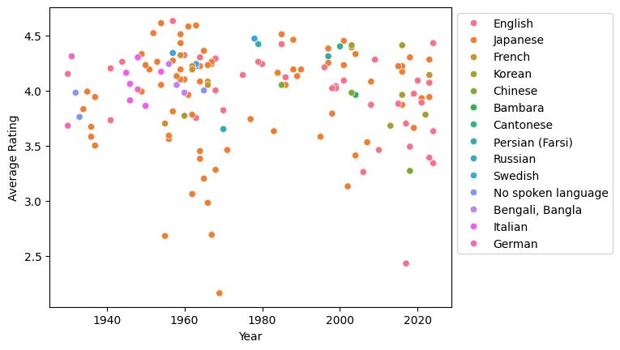

# Yamanaka

Definitely does not allow you to create plots regarding information of films from your Letterboxd profile.
More plot options will be added as I so desire.
Learn about Sadao Yamanaka [here](https://medium.com/@samskirry/the-short-and-influential-career-of-sadao-yamanaka-1909-1938-b933b8127230).

## Setup + Running
To gather data from Letterboxd, you will need to have the yamanaka flask app running from my LetterboxdWebScraper project, [steps found here]().

To create a plot, follow the below example in your command line:

Syntax: ```> py yamanaka.py USERNAME```

Example: ```> py yamanaka.py tff```

## Example
Below is an example plot that Yamanaka can generate:



